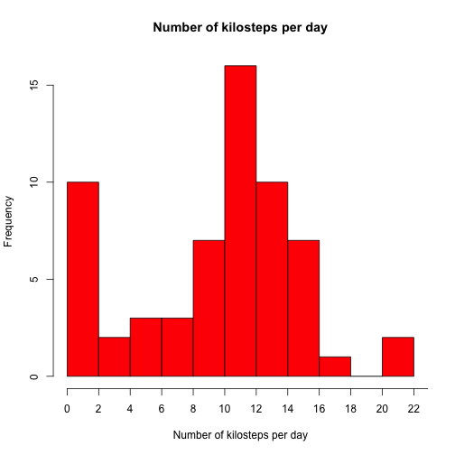

Reproducible Research, Peer Assessment 1
========================================================

First, we will load the data.


```r
data <- read.csv("activity.csv")
```


Then we split the data by days and then sum the number of steps in each day.


```r
data_day <- split(data, data$date)
sum_num_steps <- sapply(data_day, function(x) sum(x[, c("steps")], na.rm = TRUE))
```


Now, we can plot the histogram.


```r
hist1 <- hist(sum_num_steps, breaks = 8, col = "red", main = "Number of kilosteps per day", 
    xlab = "Number of kilosteps per day", xaxt = "n")
axis(1, at = seq(from = 0, to = 24000, by = 2000), labels = as.character(seq(from = 0, 
    to = 24, by = 2)))
```

 


Let us find the mean and the median of the number of steps per day. 


```r
mean_num_per_day <- sum(sum_num_steps)/length(sum_num_steps)
summary(sum_num_steps)
```

```
##    Min. 1st Qu.  Median    Mean 3rd Qu.    Max. 
##       0    6780   10400    9350   12800   21200
```


So the mean equals 9350 whereas the median 10400.

The next point task is to analyze the average daily activity pattern.
Firstly, we split the data according to intervals.

```r
data_interval <- split(data, data$interval)
mean_num_steps_interval <- sapply(data_interval, function(x) mean(x[, c("steps")], 
    na.rm = TRUE))  # NAs are removed
```


Secondly, we plot a time series of the 5-minute interval and the average number of steps taken, averaged across all days. 


```r
plot(mean_num_steps_interval, xlab = "Interval", ylab = "Number of steps", type = "l", 
    xaxt = "n")
axis(1, at = seq(from = 0, to = 300, by = 50), labels = as.character(seq(from = 0, 
    to = 300, by = 50)))
```

 


In the next step, we will find 5-minute interval that on average (across all the days in the dataset) contains the maximum number of steps.


```r
# max(mean_num_steps_interval)
max_interval <- which.max(mean_num_steps_interval)
max_interval
```

```
## 835 
## 104
```


This result requires a bit of interpretation as we have to remember that NAs where removed (so 104 is
the number of the interval in the data cleared of NAs).
Therefore to get an appropriate number of the interval we have to divide 835 by 5 obtaining: 167.

Btw. the maximum number of steps on average for a 5-minute intervals equals: 206.2 as we get below.


```r
mean_num_steps_interval[max_interval]
```

```
##   835 
## 206.2
```


This is as much as I have at the moment, the rest is missing.
